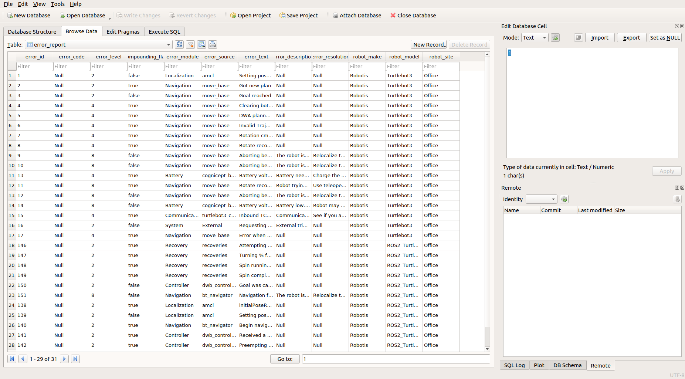

# rosrect ECS API Server

Hello there! Thanks for checking out the ECS documentation. This particular document is a user's guide. If you are more interested in what the ECS is designed for, and the architecture, please take a look at the introduction document [here][1]!

This project adheres to the Contributor Covenant [code of conduct](https://github.com/cognicept-admin/rosrect/blob/master/CODE_OF_CONDUCT.md). By participating, you are expected to uphold this code. Please report unacceptable behavior to [info@cognicept.systems](mailto:info@cognicept.systems). If you are interested in contributing, please refer to the guidelines [here](https://github.com/cognicept-admin/rosrect/blob/master/CONTRIBUTING.md).  

- [Description](#description)
- [Overview](#overview)
- [Prerequisites](#prerequisites)
- [Installation](#installation)
    * [Building Natively](#building-natively)
    * [Building through Docker](#building-through-docker)
- [Syntax](#syntax)
    * [Configure and Run for native installations](#configure-and-run-for-native-installations)
    * [Configure and Run for Docker](#configure-and-run-for-docker)
- [Examples](#examples)
    * [Exploring built-in API endpoints](#exploring-built-in-API-endpoints)
- [Related-Pages](#related-pages)

## Description
This article explains how to run the `rosrect ECS API` server.

## Overview
This article shows how to start the `rosrect ECS API` server. By the end of this, you will be able to start the API server and run a few sample GET requests from the ECS API.

## Prerequisites
Some knowledge of REST APIs and `python` is necessary.

## Installation

You can get access to the API server by cloning this repo. After this, there are a couple of choices as to how you want to build and run the API server. Either natively, or using Docker. Steps are as follows:

1. Open a terminal window.

2. Change to a folder of your choice. For example, the home folder:

        $ cd ~
    
3. Clone the repo:
    
        $ git clone https://github.com/cognicept-admin/rosrect-ecs-api-server.git
    
### Building natively:

You can use this approach if you are planning on running this on a system where installing python packages natively is not an issue. These have been tested on Ubuntu OS. Steps are as follows:

1.  The API server runs on python3. To check if `python3` is available on your system, execute the following command on the terminal. `3.6.9` is the minimum version required:

        $ python3 --version
          Python 3.6.9

    If `python3` is unavailable, the command above will error out. Please install `python3` using one of the recommended methods [here][8].
    
2. Install package dependencies using `pip3` and the provided requirements file `requirements.txt`:
    
        $ cd ~/rosrect-ecs-api-server
        
        $ pip3 install -r requirements.txt 
            Collecting sanic
            Downloading sanic-20.6.3-py3-none-any.whl (74 kB)
                |████████████████████████████████| 74 kB 2.1 MB/s 
            Collecting databases[sqlite]
            Downloading databases-0.3.2-py3-none-any.whl (18 kB)
            Collecting httptools>=0.0.10
            Downloading httptools-0.1.1-cp36-cp36m-manylinux1_x86_64.whl (216 kB)
                |████████████████████████████████| 216 kB 7.4 MB/s 
            Collecting httpx==0.11.1
            Downloading httpx-0.11.1-py2.py3-none-any.whl (77 kB)
                |████████████████████████████████| 77 kB 3.2 MB/s 
            Collecting multidict<5.0,>=4.0
            Downloading multidict-4.7.6-cp36-cp36m-manylinux1_x86_64.whl (148 kB)
                |████████████████████████████████| 148 kB 7.6 MB/s 
            Collecting websockets<9.0,>=8.1
            Downloading websockets-8.1-cp36-cp36m-manylinux2010_x86_64.whl (78 kB)
                |████████████████████████████████| 78 kB 5.1 MB/s 
            Collecting uvloop>=0.5.3; sys_platform != "win32" and implementation_name == "cpython"
            Downloading uvloop-0.14.0-cp36-cp36m-manylinux2010_x86_64.whl (3.9 MB)
                |████████████████████████████████| 3.9 MB 7.6 MB/s 
            Collecting aiofiles>=0.3.0
            Downloading aiofiles-0.5.0-py3-none-any.whl (11 kB)
            Collecting ujson>=1.35; sys_platform != "win32" and implementation_name == "cpython"
            Downloading ujson-3.1.0-cp36-cp36m-manylinux1_x86_64.whl (175 kB)
                |████████████████████████████████| 175 kB 6.0 MB/s 
            Collecting sqlalchemy
            Downloading SQLAlchemy-1.3.19-cp36-cp36m-manylinux2010_x86_64.whl (1.3 MB)
                |████████████████████████████████| 1.3 MB 9.3 MB/s 
            Collecting aiocontextvars; python_version < "3.7"
            Downloading aiocontextvars-0.2.2-py2.py3-none-any.whl (4.9 kB)
            Collecting aiosqlite; extra == "sqlite"
            Downloading aiosqlite-0.15.0-py3-none-any.whl (13 kB)
            Collecting sniffio==1.*
            Downloading sniffio-1.1.0-py3-none-any.whl (4.5 kB)
            Collecting certifi
            Downloading certifi-2020.6.20-py2.py3-none-any.whl (156 kB)
                |████████████████████████████████| 156 kB 3.5 MB/s 
            Collecting hstspreload
            Downloading hstspreload-2020.8.18-py3-none-any.whl (938 kB)
                |████████████████████████████████| 938 kB 11.0 MB/s 
            Collecting idna==2.*
            Downloading idna-2.10-py2.py3-none-any.whl (58 kB)
                |████████████████████████████████| 58 kB 7.6 MB/s 
            Collecting h11<0.10,>=0.8
            Downloading h11-0.9.0-py2.py3-none-any.whl (53 kB)
                |████████████████████████████████| 53 kB 2.7 MB/s 
            Collecting h2==3.*
            Downloading h2-3.2.0-py2.py3-none-any.whl (65 kB)
                |████████████████████████████████| 65 kB 4.3 MB/s 
            Collecting rfc3986<2,>=1.3
            Downloading rfc3986-1.4.0-py2.py3-none-any.whl (31 kB)
            Collecting urllib3==1.*
            Downloading urllib3-1.25.10-py2.py3-none-any.whl (127 kB)
                |████████████████████████████████| 127 kB 22.2 MB/s 
            Collecting chardet==3.*
            Downloading chardet-3.0.4-py2.py3-none-any.whl (133 kB)
                |████████████████████████████████| 133 kB 28.5 MB/s 
            Collecting contextvars==2.4; python_version < "3.7"
            Downloading contextvars-2.4.tar.gz (9.6 kB)
            Collecting typing_extensions
            Downloading typing_extensions-3.7.4.2-py3-none-any.whl (22 kB)
            Collecting hpack<4,>=3.0
            Downloading hpack-3.0.0-py2.py3-none-any.whl (38 kB)
            Collecting hyperframe<6,>=5.2.0
            Downloading hyperframe-5.2.0-py2.py3-none-any.whl (12 kB)
            Collecting immutables>=0.9
            Downloading immutables-0.14-cp36-cp36m-manylinux1_x86_64.whl (98 kB)
                |████████████████████████████████| 98 kB 9.9 MB/s 
            Building wheels for collected packages: contextvars
            Building wheel for contextvars (setup.py) ... done
            Created wheel for contextvars: filename=contextvars-2.4-py3-none-any.whl size=7664 sha256=f233b1ff06e760fbfbfdef900ee552cb4eecde5db4877b2be24ddcad4106eabf
            Stored in directory: /root/.cache/pip/wheels/41/11/53/911724983aa48deb94792432e14e518447212dd6c5477d49d3
            Successfully built contextvars
            Installing collected packages: httptools, immutables, contextvars, sniffio, certifi, hstspreload, idna, h11, hpack, hyperframe, h2, rfc3986, urllib3, chardet, httpx, multidict, websockets, uvloop, aiofiles, ujson, sanic, sqlalchemy, aiocontextvars, typing-extensions, aiosqlite, databases
            Successfully installed aiocontextvars-0.2.2 aiofiles-0.5.0 aiosqlite-0.15.0 certifi-2020.6.20 chardet-3.0.4 contextvars-2.4 databases-0.3.2 h11-0.9.0 h2-3.2.0 hpack-3.0.0 hstspreload-2020.8.18 httptools-0.1.1 httpx-0.11.1 hyperframe-5.2.0 idna-2.10 immutables-0.14 multidict-4.7.6 rfc3986-1.4.0 sanic-20.6.3 sniffio-1.1.0 sqlalchemy-1.3.19 typing-extensions-3.7.4.2 ujson-3.1.0 urllib3-1.25.10 uvloop-0.14.0 websockets-8.1
     

That is it for the native installation! You can now jump to [Syntax](#syntax).

### Building through Docker:

You can use this approach if you are planning on running the ECS API server on a system where you may not want to install packages natively. 

1. First, make sure you have a working [Docker installation][2].

2. You can then build the `docker` image using `docker build` and the provided `Dockerfile`:

        $ cd ~/rosrect-ecs-api-server
        
        $ docker build -t rosrect_ecs_api_server .
    
That is it for the Docker installation! You can now jump to [Syntax](#syntax).

## Browsing the Local Database
The repo has the latest database file available as `ecs.db`. This is a file database using [SQLite][3]. So it can be interacted with graphically using things like [`sqlitebrowser`][4] and programmatically using python packages like [`sqlite3`][5], [`aiosqlite`][6], [`databases`][7] etc. This API uses [`Sanic`][8] with the `databases` package. Screenshot below shows how one of the tables look in sqlitebrowser:

 

**NOTE:** If you are planning on doing updates to this local file database (either graphically or programmatically), please be aware that any update function will overwrite your changes! Either rename the local file database and use that OR help the community by posting the local changes to Error Reporting Tool (ERT), so we can classify the logs! Take a look at the ERT guide [here][9].

## Syntax
The ECS API server can be configured using the following environment variables:

| Variable     | Type   |        Default        | Description                                                                          |
|--------------|:-------|:---------------------:|:-------------------------------------------------------------------------------------|
| `ECS_DB_LOC` | String | `~/.cognicept/ecs.db` | ECS Database File location. If this location is incorrect the server will error out. |
| `ECS_API`    | String | `http://0.0.0.0:8000` | REST API Endpoint *to be served*. Use this to serve the endpoint at a desired port   |

Based on the type of installation, you can configure these variables by different methods as follows.

### Configure and Run for native installations
In case of a native installation, you can create them using the `export` command at the terminal. For e.g. here is an example set of parameters:

    $ export ECS_DB_LOC=~/rosrect-ecs-api-server/ecs.db
    $ export ECS_API=http://0.0.0.0:8000

**Note: These values are available only in the current terminal and need to be recreated every time before running the ECS API server. One way to get around this is to place these statements in the `bashrc` file**

Now, you can run the ECS API server using `python3`:

    $ python3 ecs_api_server/ecs_endpoint.py
      [2020-08-18 17:32:53 +0800] [10601] [INFO] Goin' Fast @ http://127.0.0.1:8000
      [2020-08-18 17:32:53 +0800] [10601] [INFO] Starting worker [10601]

That is it for the native configure and run! If you wish, you can press `Ctrl+C` to terminate the native server. You can now jump to [Examples](#examples).

### Configure and Run for Docker
In case of a Docker installation, you can simply use the [`runtime.env`](runtime.env) file in this repository as an example template and pass it to the docker container with the `--env-file` argument when using the `docker run` command. Simply edit the `runtime.env` like a text file, or comment the unnecessary variables and then rerun the container. Example below:

    $ docker run -it \
    --env-file runtime.env \
    -p 8000:8000 \
    --name=ecs_api_server  \
    --volume="${HOME}/rosrect-ecs-api-server/ecs.db:/root/.cognicept/ecs.db" \
    rosrect_ecs_api_server:latest  \
    ecs_api_server/ecs_endpoint.py
    [2020-08-18 09:43:01 +0000] [1] [INFO] Goin' Fast @ http://127.0.0.1:8000
    [2020-08-18 09:43:01 +0000] [1] [INFO] Starting worker [1]

**Note:** When using the dockerized API, we need to remember 2 things:
1. Expose the correct port to make sure the `ECS_API` port matches here using the `-p` option
2. Mount the database file in the correct location using the `--volume` option

That is it for the Docker configure and run! If you wish, you can press `Ctrl+C` to terminate the native server. You can now jump to [Examples](#examples).

## Examples

### Exploring built-in API endpoints

In this example, we will explore the built-in API endpoints to query the Error Reporting Table and the Error Classification Stack. The following API endpoints are available:

| API Endpoint            | Type |          Parameters          | Description                                                                                                                                                                    |
|-------------------------|:-----|:----------------------------|:-------------------------------------------------------------------------------------------------------------------------------------------------------------------------------|
| `/api/ert/getAllData`   | GET  |             `NA`             | Test API that can be used to quickly see ERT data                                                                                                                              |
| `/api/ert/getErrorData` | GET  | `RobotModel`, `ErrorText` | Primary API that can be used to retrieve ERT row corresponding to a robot model/error text combo ERT should be primarily used only in development environment, not production. |
| `/api/ecs/getAllData`   | GET  |             `NA`             | Test API that can be used to quickly see ECS data                                                                                                                              |
| `/api/ecs/getErrorData` | GET  | `RobotModel`, `ErrorText` | Primary API that can be used to retrieve ECS row corresponding to a robot model/error text combo ECS should be the primary choice in a production environment.                 |

Let's try these endpoints as follows. These should work for default cases. In case you changed the configuration, make sure the URL is appropriately changed:

1. Run the ECS API server in one of two ways as explained in the [Syntax](#syntax) section.

2. Open a browser window and access the following URL to see a snapshot of the ERT data, alternatively just click on this hyperlink and open in a new tab: [http://localhost:8000/api/ert/getAllData](http://localhost:8000/api/ert/getAllData)

3. Open a browser window and access the following URL to see a snapshot of the ECS data, alternatively just click on this hyperlink and open in a new tab: [http://localhost:8000/api/ecs/getAllData](http://localhost:8000/api/ecs/getAllData)

4. Open a browser window and access the following URL to see the result of an actual ERT query, alternatively just click on this hyperlink and open in a new tab: [http://localhost:8000/api/ert/getErrorData/?RobotModel=Turtlebot3&ErrorText=Aborting+because+the+robot+appears+to+be+oscillating+over+and+over.+Even+after+executing+all+recovery+behaviors](http://localhost:8000/api/ert/getErrorData/?RobotModel=Turtlebot3&ErrorText=Aborting+because+the+robot+appears+to+be+oscillating+over+and+over.+Even+after+executing+all+recovery+behaviors)

5. Open a browser window and access the following URL to see the result of an actual ECS query, alternatively just click on this hyperlink and open in a new tab: [http://localhost:8000/api/ecs/getErrorData/?RobotModel=Turtlebot3&ErrorText=Aborting+because+the+robot+appears+to+be+oscillating+over+and+over.+Even+after+executing+all+recovery+behaviors](http://localhost:8000/api/ecs/getErrorData/?RobotModel=Turtlebot3&ErrorText=Aborting+because+the+robot+appears+to+be+oscillating+over+and+over.+Even+after+executing+all+recovery+behaviors)

These are the kind of API calls the agent makes to perform error suppression and classification!

## Related Pages
For more related information, refer to:

* [ECS Intro Document][1]
* [Docker Installation][2]
* [SQLite][3]
* [sqlitebrowser][4]
* [sqlite3][5]
* [aiosqlite][6]
* [databases][7]
* [Sanic][8]
* [Error Reporting Tool - ERT][9]

[1]: /docs/ECS_INTRO.md
[2]: https://docs.docker.com/engine/install/ubuntu/
[3]: https://sqlite.org/index.html
[4]: https://sqlitebrowser.org/
[5]: https://docs.python.org/3/library/sqlite3.html
[6]: https://github.com/omnilib/aiosqlite
[7]: https://www.encode.io/databases/
[8]: https://sanic.readthedocs.io/en/latest/
[9]: /docs/ERT_INTRO.md