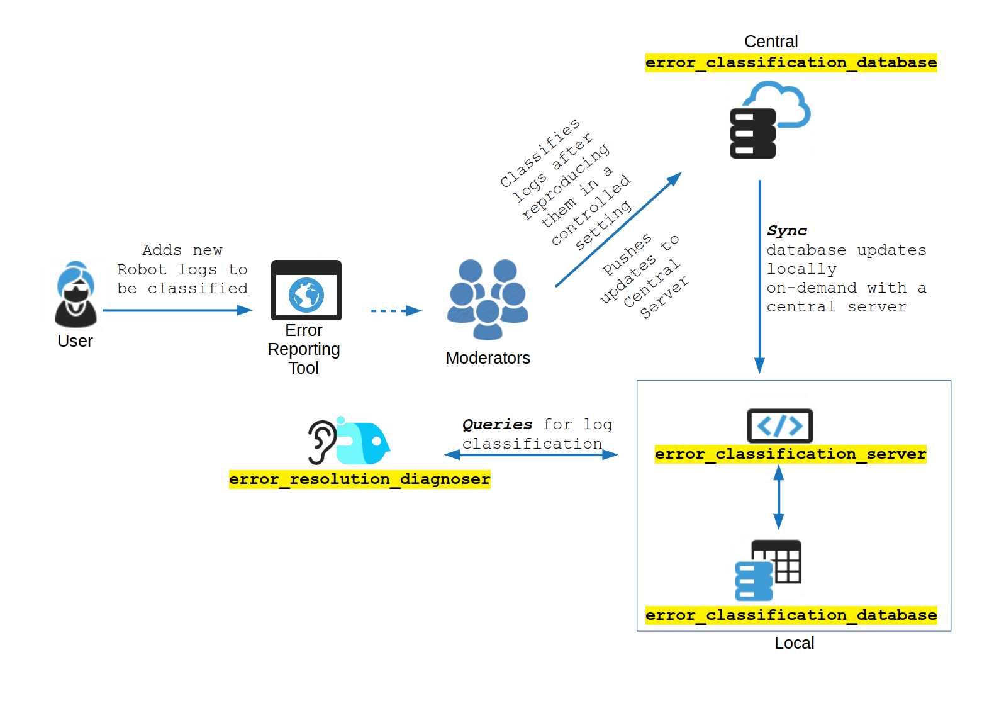

# error_classification_server <--> error_classification_database Introduction

## The Concept

Owing to the modular nature of any robot platform (a robot consists of a robot base connected to the motors, wheels, etc, sensors, and other software and network modules), the robot faces multiple sources of failures and errors. The errors and warnings are not always a result of the running of certain robot “nodes”, but also because of interactions between the robot and its environment. For example, a network failure can happen at the robot’s end, or at the end of the router supporting the robot. This particular error can potentially result in a robot lost error. 

The robot OEMs across different models and applications have worked towards standardizing their errors and robot performances, and have been fairly successful in helping the customers quickly. The problem occurs when the robot interacts with newer environment modules, or when the robot is performing tasks beyond their “scope” of operations. Arguably, the most critical element to solve in case of an error is downtime. It is not just downtime that needs attention, but also the upkeep of the same level of downtime across different geographies. This is extremely crucial if robots are to be accepted worldwide on the merit of performance. 

The proposed Error Classification System (data source + API server) is an attempt to democratize working with robots, simplify the robot errors for non-robot engineers, and also classify the errors for robust devops style error/constraints handling. 

## The Architecture

The Error Classification System (ECS) high level architecture is shown below:

 

Broadly, the architecture comprises two separate diagnostics stack - Error Reporting Tool (ERT), and the Error Classification Database. The ERT can be considered the “development version” and allows for custom development and in-house integration. The Error Classification is a production version of the error codes, and is locked. The ECS is managed by a set of moderators, who are responsible for testing of these errors, maintaining the error buckets in the ECS, and also simplifying the errors for general/broad applications. 

The ERT is the development version of the ECS, and contains errors that are submitted in the ECS, and also those errors that are yet to be synced with the ECS. There is a buffer period (proposed time is 21 days) for the errors to be studied and tested by one moderator, before it can be included in the ECS. ERT is also designed to host errors that are used for testing internally. A use case can be that a robot developer can pull in a local copy of the development stack (ERT), and can add his own custom errors and resolutions, on a local machine. We will also source for a group of moderators, who’ll be interested to maintain this stack of errors and warnings, and help the robot companies onboard their modules on the ECS. 

Once the moderators push their updates to the centrally maintained `error_classification_database`, individual users can pull updates to their local file based database on-demand to sync the data source. This way, the users decides when to upgrade rather than opting for an automatic update design. Once at the edge device, the database can be interacted with using the `error_classification_server` which opens up REST endpoints. The examples show a localhost implementation. But the server can be deployed in the cloud or a site wide location for fleets of robots to communicate to a single server as well.

## Moderators Group
We seek volunteers from universities, research labs, startups and industries,  to help us maintain the ECS. We need a diverse pool of moderators, so that the error classifications database can benefit from the variety of experience and use cases. Since the ECS is designed to be modular and exclusive, the plan in the near future is to also add environment based errors, which can be heard by robot, either through REST APIs or ROS networks. One such example is to listen to elevator related errors. PABX system can also be synced to the ECS in future. 

We propose a community of moderators, supporting different applications, and responsible to add, edit, modify the responses for the ECS, and helping the robot companies adopt it through documentation, and faq support. The moderators group meets once in 2 months to review the adoption of the tools, and necessary tools to support newer robots. The moderators are responsible for reproducing, testing and approving the errors to move from ERT to ECS (Error Reporting Tool -> Error Classification System).