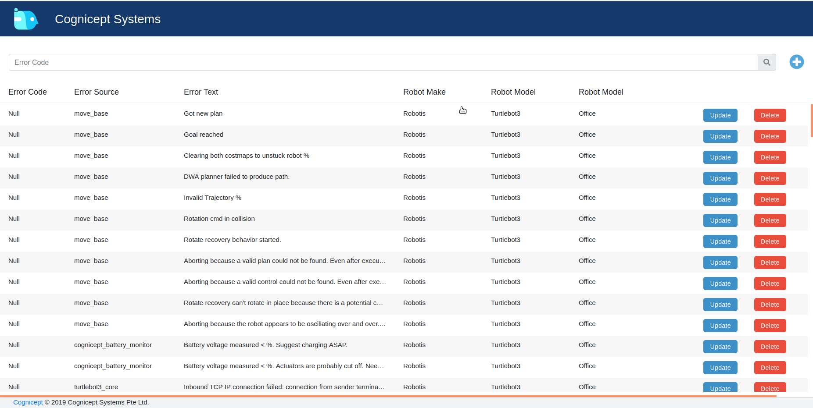
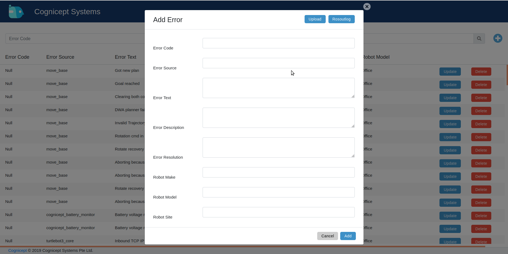
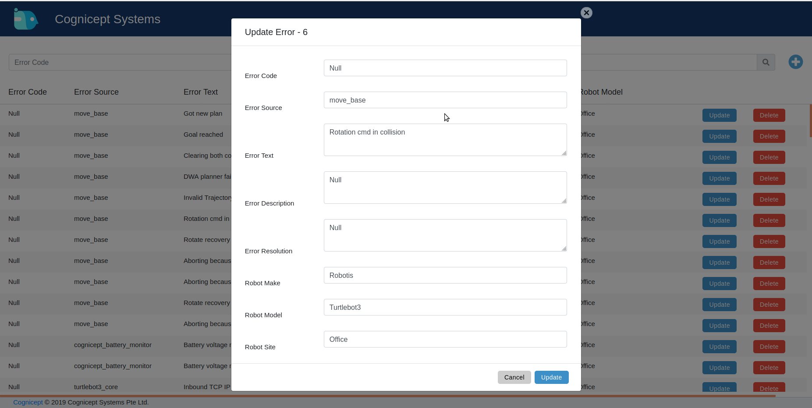
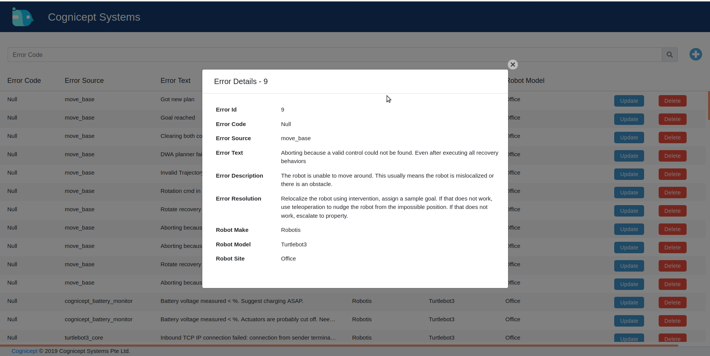
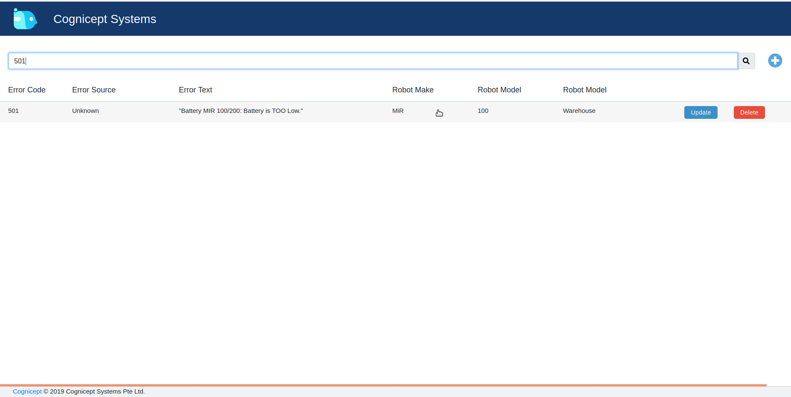
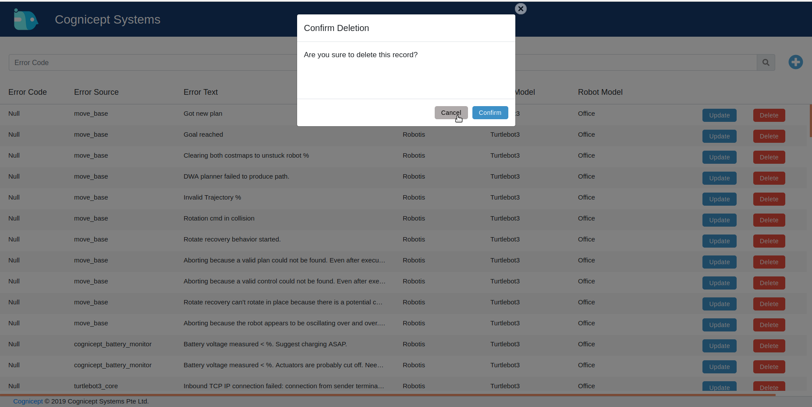

# Error Reporting Table Introduction

## The Concept

In an effort to standardize robot diagnostics, we need a collection/reporting platform. This is the Error Reporting Tool (ERT). This can be thought of as a basic CRUD (Create, Read, Update and Delete) application/web front-end to the backend error report database. Users can add (using forms or upload file logs), view, search, update and delete records. The moderators of the community will use this as the primary incoming data source. New logs added will be classified by them if warranted and pushed to the Error Classification System (ECS) with standardized error codes and resolutions.

## Quick Start

1. Access the ERT here --> [https://ert.cognicept.systems/](https://ert.cognicept.systems/)

2. The main UI looks like this:

3. You can add an error using the `+` button and fill a form. Note that there is an `Upload` option as well:

4. You can update by using the `Update` button and editing the form:

5. You can view a record just by clicking on a row and see the details view:

6. You can also search for a record by looking for it in the Search Bar:

7. Finally, you can delete a record using the `Delete` button:

